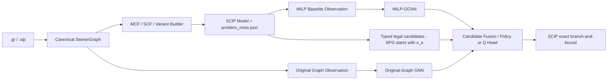
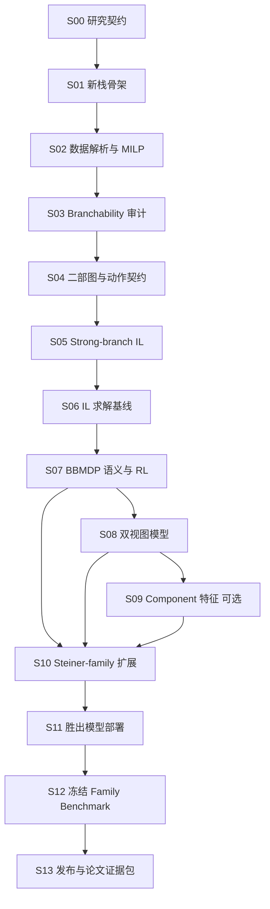

# Steiner 系列图优化问题的 MILP 强化学习分支迁移主实施方案

> 版本：v1.3
>
> 日期：2026-09-03
>
> 状态：实施中（S00--S02 本地 Gate PASS；S03/S04 资源前检完成）
>
> 适用仓库：`cable_harness_prim_gcnn`
>
> 文档性质：研究设计、工程实施、实验治理和阶段审计的唯一主入口。本文出现的新目录、命令和配置名是目标接口；在对应阶段通过 Gate 之前，不代表仓库已经具备这些能力。

---

## 0. 执行摘要

本迁移不以兼容现有航空布线训练路线为约束，也不先重构整个旧工程。最合理的做法是在同一仓库中建立一个相对独立的 `steiner_branching` 研究栈，只复用已经验证为领域无关的组件。经典无向 SPG 是建立 correctness 和 learning signal 的锚点，最终研究范围扩展到至少一个 Steiner 变体；航空布线不属于本方案的完成目标。

主路线固定为：

1. 先解决**问题和实验是否成立**：实现经典无向 Steiner Tree Problem in Graphs（SPG）的正确 MILP，确认 SCIP 在所选实例和协议下确实产生足够的分支决策。
2. 再建立**可信的学习基线**：使用标准变量—约束二部图 GCNN 模仿 strong branching；这既是主要 baseline，也是后续 RL 的初始化来源。
3. 再做**强化学习增量**：优先采用经过逐轨迹语义复核的 BBMDP 风格训练；从模仿模型初始化，纯从零 DQN 只作消融。
4. 再检验**Steiner 专属贡献**：原始图 GNN 与 MILP 二部图的双视图融合是首选研究扩展；DSU/连通分量特征是可选的低成本结构消融，不预设一定有效。
5. 再扩展到**Steiner-family**：至少加入 RPCSTP 或 PCSTP，使用 typed candidate 表示验证跨 formulation、跨变体迁移。
6. 最后才做**部署和冻结评测**：只有跨变体接口和胜出模型确定后才进入 TorchScript/C++，避免先部署 `x_e`-only 模型后再重写。

核心原则是：按“有效分支状态数、验证集收益和统计置信度”决定是否扩规模，不按“必须训练数千实例”机械扩数据。GPU 数量不是主要矛盾，SCIP rollout 和 strong-branching 标签采集通常更依赖 CPU、内存与并行实例数。

### 0.1 不做的事情

- 不把航空布线回迁作为 Steiner-family 研究的完成条件。
- 不让旧的 6 维 Prim 特征在 Steiner 变量上默认为全零后继续训练而不做 schema 审计。
- 不从零开始大规模训练 DQN，再靠增加步数判断方向是否成立。
- 不在模型尚未证明有效前重写 C++ 推理端。
- 不把原始图 GNN、双图模型或 DSU 当作“必须有”的复杂度。
- 不把 SCIP-Jack 与通用 MCF 模型的节点数直接比较。
- 不用最终测试集反复调网络、reward、阈值或实例生成器。
- 不提交大型原始数据、replay、checkpoint、构建目录和逐节点日志到 Git。

---

## 1. 研究对象与论文问题

### 1.1 “Steiner-family 图结构”的准确含义

`Steiner-family` 不是一种新的图数据结构。“图结构”表示这些 MILP 背后都有原始图 \(G=(V,E)\)，其共同任务是选择一个满足终端、收益、根、方向或其他条件的低成本连通子图。`Steiner-family` 表示以 Steiner 连通问题为核心的一族组合优化模型，例如：

| 问题 | 相对经典 SPG 的主要变化 | 典型离散实体 |
|---|---|---|
| SPG | 所有 terminals 必须连接，最小化边成本 | edge selection |
| SAP / directed STP | 图和从 root 到 terminals 的连接具有方向 | arc selection |
| NWSTP | 成本位于节点或同时位于节点、边 | vertex/edge selection |
| RPCSTP | 有 root，其他带 prize 的节点可以不连接 | vertex activation + edge selection |
| PCSTP | 无固定 root 或需在转换中选择 root，允许支付遗漏 prize | vertex activation + edge selection |
| MWCS | 选择最大权重连通子图 | vertex selection |
| DCSTP / GSTP / hop-constrained | 增加度、分组或跳数约束 | edge/vertex/group-related variables |

它与当前方案中的 Steiner 树不是并列关系：**当前无向 SPG 是 Steiner-family 的基础成员**。二者共享原始图、连接性、SCIP 精确求解和 solver–topology 双视图；不同点是变体会改变目标、terminal 是否强制、方向性、MILP formulation 以及可分支变量类型。

本方案采用分层范围：

- **基础范围**：经典无向 SPG，先完成 MCF/SCF、IL、RL 和双图验证；
- **最终范围**：在 SPG 之后至少完成 RPCSTP 或 PCSTP 中一个变体；
- **扩展范围**：只有前一变体通过 branchability 和迁移 Gate 后，再考虑 MWCS、NWSTP 或其他变体。

因此不在第一阶段同时实现所有变体，也不允许最终论文在只完成 SPG 时把结论外推为整个 Steiner-family。

### 1.2 SPG 基础阶段的问题边界

第一版只研究经典无向边权 Steiner Tree Problem in Graphs：

- 输入为连通无向图 \(G=(V,E)\)；
- 边权 \(c_e>0\)；
- 终端集合 \(T\subseteq V\)；
- 求连接全部终端的最小权重子图；正权条件下存在树形最优解；
- SCIP 保留精确求解和最优性证明，学习模型只选择合法分支变量。

SPG 阶段不同时覆盖 prize-collecting、directed、node-weighted、degree-constrained 等变体。它先固定最简单、可核验的动作语义；变体在 S10 按 Gate 逐一进入。

### 1.3 研究问题

| 编号 | 研究问题 | 必须回答的对照 |
|---|---|---|
| RQ0 | 自建 Steiner MILP、变量映射和解验证是否正确？ | 已知最优值、穷举小图、SCIP 解文件检查 |
| RQ1 | 标准 MILP 二部图 GCNN 能否学习 Steiner 的 branching signal？ | random、most-infeasible、relpscost、strong branching |
| RQ2 | BBMDP 风格 RL 是否在模仿学习之上改善整棵搜索树表现？ | IL 初始化、从零 RL、相同网络与求解协议 |
| RQ3 | 原始 Steiner 图与 MILP 二部图的双视图融合是否改善跨规模、跨图族泛化？ | MILP-only、original-only、dual-view |
| RQ4 | 显式连通分量/DSU 特征是否提供双图模型未学到的增量信息？ | dual-view 与 dual-view+component 配对消融 |
| RQ5 | solver–topology 表示和策略能否跨 MCF/SCF 及 SPG/RPCSTP/PCSTP 迁移？ | zero-shot、from-scratch、shared encoder+task head、multi-task training |
| RQ6 | learned branching 在 SCIP-Jack 真正进入 B&B 的 hard subset 上是否仍有增量价值？ | SCIP-Jack 原策略、random、learned typed candidate policy |

### 1.4 主张层级

最终论文主张必须随证据降级，不能预先写死：

- **最低可成立主张**：建立了可复现的 Steiner MILP learning-to-branch benchmark，并系统比较 SCIP 规则、模仿学习和 RL。
- **理想主张**：RL 在多个随机种子和未见图族上稳定优于 IL 与通用 SCIP branching baseline。
- **结构创新主张**：双视图模型在跨规模或跨分布测试上带来显著且可重复的收益，且收益高于推理开销。
- **Steiner-family 主张**：共享表示在至少一个非 SPG 变体上优于相同预算的 from-scratch 基线，或在跨 formulation 测试中表现出可重复的正迁移。
- **专业求解主张**：只在 SCIP-Jack hard subset 有足够 branching signal 且 learned policy 有增量时成立；否则 SCIP-Jack 仅是完整求解器外部 baseline。

如果 RL 没有超过 IL，必须如实把 IL 作为最终学习方法，把 RL 作为负结果或分析章节；如果双图没有增益，就不将其部署为最终模型。

---

## 2. 当前仓库的真实起点

### 2.1 当前 GCNN 不是纯通用模型

当前 `BipartiteGCNNQNetwork` 的主要结构为：

- 变量连续特征：Ecole 19 维 + Prim/DSU 6 维，共 25 维；
- 变量类别：航空变量 `m/z/y/absf/f/other` 的 6 维 one-hot；
- 约束连续特征：14 维扩展行特征；
- 约束类别：航空约束 6 维 one-hot；
- 二部边特征：3 维；
- 全局求解状态：14 维；
- 各输入经 `input -> 128 -> 64` MLP 编码；
- 一次 `variable -> constraint -> variable` 消息传播，使用 mean aggregation；
- 候选变量嵌入与全局嵌入拼接后输出一个标量 Q，或输出分布式 logits；
- 标量配置约 157,953 个参数。

它的网络并不因“简单”而天然落后。learning-to-branch 的常见模型本来就强调较小的二部图网络和低推理开销。当前真正限制迁移的不是层数，而是 schema、变量命名、动作集合、领域特征、数据分布、reward 和 C++ 固定维度均与航空问题耦合。

### 2.2 可复用与应隔离的内容

| 现有模块 | 第一阶段处理 | 理由 |
|---|---|---|
| Ecole `NodeBipartite` 复制与不可变数组处理 | 选择性提取为通用实现 | 19/5/1 基础特征可复用 |
| 候选精确二跳闭包 | 在一轮二部传播模型中复用并重测 | 可精确降低图存储和推理成本 |
| DQN、PER、n-step、target network | 只作参考，不直接继承实验语义 | 算法组件可用，但 reward/termination/profile 要重新验证 |
| strong-branching 采样代码 | 选择性移植 | 需改为只标注 Steiner `x_e` 候选并重做有效标签审计 |
| 航空变量/约束类别 | 不进入 Steiner baseline | 名称和语义不成立 |
| 现有 Prim 正则和 6 维实现 | 不进入首个 baseline | 当前只识别航空 `z_*_*_prime`，Steiner `x_e` 会全零 |
| 航空实例课程与 reward 配置 | 不复用 | 会污染问题定义和实验解释 |
| C++ 固定 25 维推理 | 暂不修改 | 模型未胜出前修改没有研究收益 |

### 2.3 新旧代码边界

建议新建独立包，而不是先把 `python/rl_branching` 改成能容纳所有问题：

```text
python/steiner_branching/
  data/               # .gr/.stp、生成器、manifest、split
  milp/               # MCF/SCF、命名、解验证
  solver/             # SCIP profile、observation、teacher、environment
  models/             # MILP-GCNN、原始图 GNN、双图融合、heads
  learning/           # imitation、BBMDP、replay、checkpoint
  evaluation/         # runner、metrics、统计分析

scripts/steiner/
configs/steiner/
tests/steiner/
docs/steiner/
```

通用代码在 Steiner 路线稳定后再抽到 `python/branching_common/`。过早抽象会把旧假设一并固化进新接口。

### 2.4 现有文件到新栈的迁移映射

| 现有文件 | 新栈目标文件 | 处理方式 |
|---|---|---|
| `python/rl_branching/observation.py` | `solver/bipartite_observation.py` | 只移植 Ecole 标准特征、复制语义和必要 SCIP 元数据；扩展特征另起 schema |
| `python/rl_branching/graph_features.py` | `solver/graph_state.py` | 重写类别和维度；保留候选闭包算法并重新证明 parity |
| `python/rl_branching/gcnn_model.py` | `models/milp_gcnn.py` | 以 Gasse-style B0 为新基线，不保留航空 one-hot 和 Prim 输入 |
| `python/rl_branching/ranking/sb_ranking_collection.py` | `solver/strong_branch_teacher.py` | 复用采样经验，重写 action filter、metadata 和有效标签统计 |
| `python/rl_branching/environment.py` | `solver/bbmdp_env.py` | 到 S07 才按选定论文语义移植，不复制旧 reward/profile |
| `python/rl_branching/gcnn_dqn.py`、`graph_replay.py` | `learning/{dqn,replay}.py` | 单元级选择性复用；增加可变候选和字节预算测试 |
| `scripts/train_gcnn.py`、`run_baselines.py` | `scripts/steiner/*` | 新 CLI 和 run manifest，不增加隐藏的 problem-type 分支 |
| `src/rl/scip_graph_feature_extractor.*` | S11 后决定 | 跨变体接口和胜出模型确定前保持不动 |
| `src/rl/gcnn_model_runner.*`、`rl_gcnn_branchrule.*` | S11 改为 manifest 驱动 | 不再把 25 维、航空类别和旧模型签名写死 |

任何“复制后再删航空逻辑”的做法都应在 diff 中解释；如果一个文件超过一半逻辑需要条件分支，优先新建小而清楚的实现。

---

## 3. 目标技术架构

### 3.1 总体数据流



### 3.2 三种图模型的定位

#### B0：标准 MILP 二部图 GCNN

第一基线尽量贴近 Gasse 等人的标准表示：

- 变量节点：Ecole 19 维；
- 约束节点：Ecole 5 维；
- 二部边：归一化系数 1 维；
- 一次变量到约束、一次约束到变量传播；
- 只对合法 fractional `x_e` 候选输出分数。

这是必须完成的通用 baseline，也是回答“简单网络是否足够”的直接实验依据。

#### B1：增强求解状态 MILP-GCNN

在 B0 之后单独验证：

- 14 维全局树状态；
- 更完整的行状态与边系数特征；
- 1 层和 2 层二部传播；
- embedding 64 与 128。

一次只改变一项。若增强模型不能改善验证集的求解指标，最终系统保留 B0，而不是默认堆深网络。

#### G：原始 Steiner 图 GNN

原始图以顶点为节点、原始边为边：

- 静态节点特征：是否 terminal、是否 root、degree、weighted degree；
- 可选静态特征：到 root/最近 terminal 的归一化最短路距离；
- 静态边特征：权重、相对权重、端点度数；
- 动态边特征：对应 `x_e` 的 LP value、fractionality、local bounds；
- 使用 2–3 层轻量 GINE/edge-aware message passing；
- 候选边嵌入由两个端点嵌入和边嵌入组成。

原始图 GNN 单独运行时看不到完整 LP 约束、reduced cost、dual、cuts 和 basis，因此不能替代 MILP 二部图，只能作为消融或互补视图。

#### D：双视图融合

对候选边变量 `x_e`：

\[
h_e = [h^{MILP}_{x_e}, h^{Graph}_e, h^{global}]
\]

再由共享 MLP 输出 imitation logits 或 RL Q-value。第一版采用 late fusion，避免复杂的跨图 attention。只有 late fusion 已证明有效后，才研究 cross-attention。

### 3.3 为什么二部图是核心而双图不是前置条件

- SCIP 的 branching state 本质上属于当前 LP/MILP，而不是只有原始 Steiner 拓扑；变量—约束二部图直接承载 fractionality、objective、reduced cost、dual、basis 和 cut 产生的动态信息。
- 原始图提供 terminal、路径、瓶颈和连通性等领域结构，但单独无法完整表示求解器当前状态。
- 双图的研究意义是验证两种信息是否互补，而不是假定“图问题一定需要两个 GNN”。
- 因此，二部图是推荐核心和标准 baseline；双图是有明确假设、必须通过消融的论文扩展。

### 3.4 从 SPG `x_e` 到 Steiner-family typed candidates

SPG 基础阶段只学习 edge-selection 变量 `x_e`，这是为了先固定一个干净的动作空间。进入变体后，不再假设所有合法分支变量都能对应原始边，而统一表示为：

```text
CandidateEntity
  scip_variable_id
  entity_kind: EDGE | ARC | VERTEX | TERMINAL_ACTIVATION | OTHER
  original_entity_id
  formulation_id
  milp_variable_embedding
  topology_embedding
  topology_embedding_valid_mask
```

- edge/arc candidate 对齐原图边或弧；
- vertex/terminal candidate 对齐原图节点；
- 无可靠原图对应关系的辅助 binary 只使用 MILP embedding，并将 topology mask 设为 0；
- shared encoder 后接 type embedding 和 task-specific policy/Q head；
- SCIP 当前合法 candidates 始终是动作集合上界，typed schema 不能删除难以映射的合法变量后静默继续。

这使“跨变体”成为可检验的表示学习问题，而不是通过变量名正则把所有变体强行伪装为 `x_e`。

### 3.5 候选子图策略

对于一轮 `variable -> row -> variable` 的二部图模型，可以继续使用候选并集的精确二跳闭包；必须用完整图与二跳图 Q 值、排序和 argmax 一致性测试证明等价。

若增加第二轮消息传播，原二跳等价性自动失效。此时必须：

- 扩大到满足感受野的精确闭包；或
- 使用完整图；或
- 明确将近似采样作为新的方法变量并做误差消融。

原始 Steiner 图不能直接套用 MILP 二跳闭包；应采用完整原图、分图 batching 或经过验证的邻域采样。

---

## 4. Steiner MILP 建模契约

### 4.1 首选：rooted multi-commodity flow（MCF）

选定一个确定性 root \(r\in T\)。对每条无向边 \(e=\{i,j\}\) 定义二元变量 \(x_e\)，对每个非根终端 \(t\in T\setminus\{r\}\) 和有向弧 \((i,j)\) 定义连续流 \(f^t_{ij}\in[0,1]\)。

目标函数：

\[
\min \sum_{e\in E} c_e x_e
\]

每个 commodity 的流平衡：

\[
\sum_{(v,w)} f^t_{vw}-\sum_{(w,v)} f^t_{wv}=
\begin{cases}
1 & v=r\\
-1 & v=t\\
0 & \text{otherwise}
\end{cases}
\]

边选择联动：

\[
f^t_{ij}+f^t_{ji}\le x_{\{i,j\}},\quad
e=\{i,j\},\ t\in T\setminus\{r\}
\]

第一版只允许 `x_e` 进入学习动作集合。`f` 全部连续，不应成为分支动作。

MCF 的优点是定义清楚、连接性直观、适合 PACE Track 1 的少终端实例；缺点是规模为 \(O(|E||T|)\)。它是 formulation，不是 Prim 或 MST 算法。

### 4.2 root 和命名规则

- 第一版 root 固定为规范化后编号最小的 terminal；不得按验证结果更换 root。
- 原始顶点规范化为连续整数 ID，同时在 metadata 保存原 ID。
- 无向边有唯一 `edge_id`，支持平行边，不能只用端点字符串当主键。
- 变量建议命名为 `stp_x_e00000042`、`stp_f_t0003_a00000084`。
- `problem_meta.json` 保存 `edge_id -> endpoints -> x_name`、terminals、root、来源、校验和、formulation 版本和生成配置。
- SCIP transformed variable 的映射必须通过规范名和显式映射处理；不能依赖随意截取字符串。

### 4.3 第二 formulation：SCF，仅在触发条件下实施

如果 MCF 的 p95 内存、建模时间或流变量数量超过预先定义的资源上限，才实现 rooted single-commodity flow（SCF）：root 发送 \(|T|-1\) 单位流，每个非根 terminal 消耗 1 单位，弧流受 \((|T|-1)x_e\) 约束。

SCF 更小但 LP 通常更弱，会改变 branch-and-bound 行为。它有两个合理用途：

- 作为扩规模 formulation；
- 作为跨 formulation 泛化测试。

不能把 MCF 训练、SCF 测试的节点数直接解释为策略优劣；必须把 formulation 作为实验因子。

### 4.4 Steiner-family 变体建模契约

S10 推荐先扩展 RPCSTP，再根据 branchability 和数据质量决定是否加入 PCSTP。原因是 RPCSTP 保留 root 语义，与 SPG 的原图 encoder 和 component 状态更容易对齐；PCSTP 再引入更一般的可选 prize 节点和 root/变换处理。

每增加一个变体必须单独冻结：

- 数学定义、目标和可行解 checker；
- 使用原生 formulation 还是到 Steiner arborescence 的等价转换；
- edge、arc、vertex、terminal-activation 等变量的 entity mapping；
- 哪些 SCIP candidates 由学习策略评分，哪些由 task-specific head 处理；
- 已知 optimum/bounds、公开数据来源和许可证；
- 与 SCIP-Jack 的比较层级。

不能只把 PCSTP/RPCSTP 转成某个 `.cip` 后沿用 SPG `x_e` 正则。转换前后的原始实体、SCIP variables 和候选动作必须由 metadata 显式关联。

### 4.5 与当前航空代码的关系（仅作为迁移背景）

当前航空模型属于多源—目标的多商品流，并额外包含 commodity 到 topology copy 的分配、共享有向拓扑和顺序约束。Steiner MCF 则是每个 terminal 到共同 root 的 commodity 共享 `x_e`。两者都用多商品流表达连接性，但并不等价；航空模型也不自动属于本文定义的 Steiner-family benchmark。

当前代码中的 DSU 思想更接近“已固定边形成的 forest/component 状态”，在算法直觉上接近 Kruskal，而不是 MCF，也不是严格的 Prim。它只作为新 component 特征的实现经验，不形成航空回迁任务。

### 4.6 正确性检查

每个 formulation 必须同时通过：

- 手工可验证的小图：路径、三角形、星形 Steiner 点、平行边、冗余高价边；
- 小规模边子集穷举器的最优值；
- PACE 已知最优值；
- 输出子图连通全部 terminals；
- 输出目标与 SCIP objective 一致；
- 不连通输入被明确拒绝；
- 相同输入与配置产生相同 model/metadata hash。

---

## 5. 数据集与数据治理

### 5.1 数据来源和用途

| 数据 | 用途 | 是否允许调参 |
|---|---|---|
| 自生成多图族 SPG | 训练、内部验证、IID/OOD 测试 | 仅 train/validation |
| PACE 2018 Track 1 odd | 公共开发集，MCF 主外部分布 | 可以，但所有使用必须记录 |
| PACE 2018 Track 1 even | 封存最终测试集 | 不允许 |
| PACE 2018 Track 2 odd/even | 低树宽与规模压力测试；MCF 不可承受时转 SCF | odd 可开发，even 封存 |
| SteinLib 经典 SPG testsets | 家族级 OOD benchmark | 预先指定 dev/test 家族 |
| 11th DIMACS SPG | 最终外部 benchmark | 不允许调参 |
| 11th DIMACS/SCIP-Jack 的 PCSTP、RPCSTP、MWCS 等集合 | S10 变体开发和最终跨变体 benchmark | 每个变体预先划分 dev/test；首轮只选一个变体 |

PACE 的 odd/even 划分沿用当年 public/hidden 的历史边界；虽然 hidden 实例现已公开，仍可作为预注册的防泄漏边界。若实际使用前已经在 even 上多次看结果，应在报告中承认并重新指定封存来源。

变体数据不能与 SPG 数据混为一个随机 split。每个 problem variant 单独记录来源、变换链、optimum/bound 质量和 family-level split；跨变体训练时再用上层 multi-task manifest 引用这些只读 split。

### 5.2 合成数据不等于低质量数据

训练集至少包含以下图族，而不是只用单一 Erdős–Rényi：

- sparse Erdős–Rényi / configuration model；
- random geometric graph；
- grid、grid-with-holes、近似 VLSI/障碍布线图；
- community/block graph；
- 带 bridge、bottleneck 和多个候选走廊的图；
- 权重分布包括整数均匀、距离相关和轻度扰动。

生成器参数覆盖：

- \(|V|\)、\(|E|/|V|\)；
- terminal 数量和 terminal ratio；
- 平均度、直径、聚类系数；
- 边权跨度；
- root 到 terminal 的距离分布。

质量过滤依次检查：

1. 图连通且 terminal 合法；
2. formulation 正确且能在资源上限内建立；
3. root LP 与求解轨迹有非平凡 branching signal；
4. 排除几乎全部 root solved 的分布和极端不可处理的分布；
5. 记录被过滤原因，不能静默丢弃困难实例。

### 5.3 不预设“数千实例”

数据预算按有效状态决定：

- branchability pilot 先覆盖全部图族、规模桶和 terminal 桶；
- strong-branching pilot 先检查有效标签率和候选区分度；
- 只有 teacher Gate 通过才扩到正式 ranking states；
- RL 按 unique instances、有效 transitions、图族覆盖率和 validation learning curve 决定是否继续；
- validation 指标进入平台期后继续堆实例没有默认正当性。

正式 teacher 数据量不写成固定“数千实例”。可以把 20k high-quality ranking states 设为首个容量检查点，但是否继续扩展由 S03/S05 的标签有效率、图族覆盖和 validation learning curve 决定；它不是 Steiner 领域定律，也不是阶段通过的充分条件。

### 5.4 划分和防泄漏

- train/validation/test 按完整 instance 划分，绝不按 B&B state 随机拆分。
- 同一 base graph 的 terminal/weight 变体只能出现在同一 split。
- 生成器 seed 区间、图族和参数桶写入只读 `split_manifest.json`。
- normalization 只统计 train。
- strong-branching 标签、最优值、solver logs 不进入输入特征。
- final test 的结果文件写入后只允许做一次主分析；追加实验必须标为 post-hoc。

### 5.5 Git 中保存什么

提交：

- 下载脚本、生成器、license/citation 信息；
- instance manifest、split manifest、SHA256；
- 小型 toy fixtures；
- 汇总 CSV/JSON 和绘图脚本。

不提交：

- 全量 `.cip`、原始大数据压缩包；
- replay buffer、逐状态 tensor；
- 大 checkpoint；
- SCIP build、LibTorch build、临时日志。

大型产物使用 GitHub Release、对象存储或后续引入 DVC；无论采用哪种方式，Git 中必须有 artifact manifest 和下载/校验命令。

### 5.6 SteinLib/DIMACS 获取与发布许可边界

SteinLib 和 DIMACS 只允许从机器可读 provenance 配置登记的官方 HTTPS 入口
下载，并在使用前验证 archive/member SHA-256。hash 不一致必须 hard fail，不能
换镜像、删样本或调整 selector 继续实验。raw cache 始终位于 Git ignored 路径。

在公开发布前若仍无法确认显式再分发许可，release、容器和论文附件只能发布
官方 URL、source revision、下载/验证脚本、checksum manifest、citation 和许可
状态，不得携带 raw bytes。checksum 是身份凭据，不是许可证。机器可读政策见
`configs/steiner/data_provenance_v1.yml`，解释见
`docs/steiner/DATA_PROVENANCE_POLICY.md`。

---

## 6. 实验协议

### 6.1 五层协议

| 协议 | 目的 | 关键设置 |
|---|---|---|
| P0 `correctness-v1` | 检查 formulation、映射和解 | toy/known optimum、短时限、详细日志 |
| P1 `controlled-branching-v1` | 隔离 branching policy 的科学比较 | 1 thread；固定 presolve/cuts/heuristics/restarts/node selector；固定 seeds |
| P2 `generic-scip-v1` | 检查实际通用 SCIP 表现 | 同一 MCF/SCF；默认或明确记录的 SCIP 全功能设置 |
| P3 `scip-jack-external-v1` | 与专业 Steiner solver 比较整体求解能力 | 原始 `.gr/.stp`；SCIP-Jack 自身模型、预处理、cuts 和 branching |
| P4 `scip-jack-branching-hard-v1` | 检查专业求解流程中 learned branching 的边际价值 | 只用确实进入 B&B 的预注册 hard subset；保留 SCIP-Jack reduction/separation；比较其原生与 learned typed policy |

P1 允许为了可控实验关闭部分求解组件，但它不是生产性能。P2 必须恢复完整 generic SCIP。P3 只比较 solved rate、time、gap、primal-dual integral 等整体指标，不比较节点数，也不宣称 branching policy 单独导致差异。P4 不是从 P3 结果中事后挑选“模型赢”的实例；hard subset 只能按 frozen baseline 是否实际进入 B&B、分支次数和资源阈值预注册。

SCIP-Jack 不是 generic SCIP 的一个简单参数模式，而是一套包含 Steiner reader、problem transformation、reduction、cut separation、heuristics、propagation 和 branching 的专业应用/插件栈。公开的 SPG 研究还报告：其测试实例中少于 5% 真正需要 branching，并且进入 B&B 后采用图上的 vertex branching。因此 P3 是必做的完整求解器参照，P4 learned branching 只能在 branchability audit 通过后实施，不能把 MCF 的 edge-variable policy 原样接入。

### 6.2 必备 baseline

- SCIP default branching；
- SCIP `relpscost`；
- random candidate；
- most-infeasible；
- full/limited strong branching，仅在可承受子集；
- B0 standard MILP-GCNN imitation；
- B1 enhanced MILP-GCNN（若 B1 Gate 通过）；
- RL from IL initialization；
- RL from scratch，仅作消融；
- original-graph-only、dual-view、dual-view+component，仅在对应阶段完成后加入；
- SCIP-Jack 作为外部 solver baseline，单独成表。
- S10 后增加 per-variant from-scratch、SPG-pretrained fine-tuning 和 shared-encoder multi-task policy；
- P4 中增加 SCIP-Jack 原生 vertex branching 与 learned typed vertex policy。

SPG 的自定义 branchrule 只能从 SCIP 当前合法 fractional `x_e` candidates 选择；变体和 P4 则从预注册的 typed legal candidates 评分。没有候选时返回 SCIP 的合法控制状态，模型错误、NaN、映射失败和意外 fallback 必须单独计数。若只评分候选子集，未覆盖候选及 fallback 规则必须显式作为实验协议，不能静默交给默认规则。

### 6.3 核心指标

主指标：

- solved rate；
- PAR-2；
- shifted geometric mean wall time；
- primal-dual integral（PDI）；
- 固定预算下 final gap。

诊断指标：

- shifted geometric mean nodes、LP iterations；
- time to first incumbent；
- root gap；
- branching decisions；
- feature extraction、model inference 和 callback 总开销；
- model fallback、invalid action、NaN、timeout、memory-out；
- paired wins/losses 和大于 2 倍 catastrophic slowdown 比例。

模型指标：

- strong-branch top-1/top-k；
- normalized strong-branching regret；
- rank correlation；
- Q/return calibration；
- validation TD error 只作训练诊断，不用于宣称求解更好。

### 6.4 统计口径

- 使用多个 solver seed 和多个 training seed；正式数量在 S00 预注册。
- 使用 paired instance-seed 比较。
- 对 shifted geometric mean、PAR-2、PDI 报告 bootstrap 置信区间。
- Wilcoxon 等配对检验可作补充，不代替 effect size。
- 同时报告 solved/unsolved 数量，不能只报告已求解实例均值。
- checkpoint 只依据 validation 求解指标选择，不能依据 final test 或训练 loss 选择。

---

## 7. 强化学习主方案

### 7.1 为什么不以纯 DQN from scratch 为主线

branching 的单次动作影响整棵搜索树，reward 延迟、环境昂贵、候选集合可变，且 SCIP 已有很强的启发式规则。从零探索会浪费大量 solver rollout，并可能只学到脆弱的短期代理目标。

最有效的顺序是：

1. strong branching imitation 学会基本候选排序；
2. 使用该 encoder/policy 初始化 RL；
3. RL 优化整棵树指标，修正 imitation 与最终目标的不一致；
4. 保留 from-scratch RL 证明初始化的作用。

### 7.2 BBMDP 采用条件

仓库已有名为 BBMDP 的环境和 Double DQN 组件，但不能仅凭名称视为论文复现。S06 必须：

- 阅读并固定采用的 BBMDP 论文/官方实现版本；
- 写出 state、action、transition、reward、terminal、truncation 的数学和代码对应关系；
- 用小树 trace 对照官方语义；
- 解释 gamma、n-step 和 tree return；
- 区分 solver timeout、node limit 和真正 terminal；
- 验证 replay 中 action index 在子图裁剪后仍正确。

只有语义审计通过，才能称为 BBMDP-style RL；否则应使用中性名称 `branching_dqn_v1`。

### 7.3 RL 配置原则

- 主模型从最佳 IL checkpoint 初始化；
- Double DQN、target network、n-step、PER 可保留，但每项均需单独配置和测试；
- behavior policy 使用 epsilon exploration 或 SCIP/IL 混合，不允许隐式 fallback；
- reward 使用版本化定义，主 reward 优先遵循选定 BBMDP 参考实现；
- timeout/node-limit transition 标为 truncation，不伪装为自然终止；
- replay 同时受条数和实际字节限制；
- checkpoint 由 validation PAR-2/PDI/nodes 的预注册组合选择；
- 环境 transitions、gradient updates、unique instances 和 wall/CPU-hours 分开报告。

### 7.4 RL 晋级标准

RL 只有满足以下条件才进入双图和大规模训练：

- 多个训练 seed 均无发散、NaN 或动作映射错误；
- 相对 IL 在 P1 validation 上有方向一致的改进；
- 改进不只来自单个图族或单个异常实例；
- catastrophic slowdown 没有显著恶化；
- 推理开销已从 solver 时间中单独测量；
- 增加 rollout 后的 learning curve 尚未进入无收益平台。

未通过时先检查 reward/transition/选模口径，不自动增加网络层数或训练实例。

---

## 8. Steiner 连通分量特征的正确定位

### 8.1 暂不把旧 Prim 6 维放进 baseline

当前实现解析航空变量名并按 topology copy 建 DSU。直接用于 `stp_x_e` 会得到全零特征，因此首个标准 baseline 必须去掉它，而不是证明 DSU 思想无效。

### 8.2 可选的 Steiner component 特征

若进入 S09，重新定义为：

- `both_unseen`；
- `one_seen_frontier`；
- `different_components_merge`；
- `same_component_cycle_risk`；
- 两端 component size ratio；
- 两端是否属于 root component；
- 两端 component 内 terminal count/ratio。

DSU 只用当前 B&B 节点中 `local_lb(x_e)>0.5` 的边合并。LP value 大于 0.5 不代表已固定，不能用于硬合并。

这些特征描述的是“已固定 forest 的连通分量”，更接近 Kruskal/component-aware prior。它们只能作为 soft features，不能 hard-mask 合法候选，因为 Steiner 最优树允许经过非终端节点，局部 cycle 判断也不能替代 MILP 可行性。

### 8.3 保留条件

component 特征必须在相同模型、数据、seed、协议下对比：

- B1 vs B1+component；
- dual-view vs dual-view+component。

只有 validation 和至少一个 OOD dev 集均有稳定增益，且收益不是 train-only，才进入最终模型。

---

## 9. 分阶段实施与 Gate

阶段编号不是时间表。真正容易消耗算力和排错 token 的部分按风险排序如下：

| 风险优先级 | 阶段 | 主要风险 | 为什么必须先设 Gate |
|---|---|---|---|
| P0 | S02 | formulation 或 optimum checker 错误 | 后续所有数据和结论都会失效 |
| P0 | S03 | 实例没有足够 branchability | 训练再久也没有有效动作信号 |
| P0 | S05 | strong-branch 标签无效、tie 或映射错 | IL 和 RL 初始化都会学习错误目标 |
| P0 | S07 | tree transition/reward/truncation 语义错 | loss 可下降但策略目标不成立 |
| P0 | S10 | 变体 formulation、typed action 或实体映射不正确 | 跨变体结果失去数学和动作语义 |
| P1 | S11 | Python/C++ schema 与 transformed variable 不一致 | 离线收益无法转化为实际 solver 收益 |
| P1 | S12 | baseline/seed/test 泄漏或统计不公平 | 结果无法用于论文主张 |
| P2 | S08/S09 | 模型复杂度无增量收益 | 容易产生大量无意义架构试验 |

因此最先投入的资源应是 correctness tests、branchability probe 和数据审计，而不是多卡长训。

### 9.1 依赖关系



关键路径是 S00–S07、S10–S12。S08 是目标方法扩展但允许以 MILP-only 负结果回退，S09 始终可选。若最终只完成 S00–S09 和 SPG 评测，论文结论必须限定为 SPG，不能使用 Steiner-family 主张。

### S00：研究契约与环境冻结

**目标**：所有会影响结论的定义先于结果固定。

**工作**：

- 固定 SPG、MCF、root 规则、动作只选 `x_e`；
- 固定 P0–P3 协议、time/node/memory limits、solver/training seeds；
- 固定数据分割原则与 final test 封存规则；
- 记录 SCIP、SoPlex、PySCIPOpt、Ecole、PyTorch、编译器、CPU/GPU 版本；
- 决定是否沿用当前 SCIP 8/Ecole 0.8 环境；升级必须单独做兼容性实验；
- 写 ADR：formulation、图表示、RL 算法、实验统计各一份；
- 建立 `docs/steiner/STATUS.md` 和阶段登记表。

**交付物**：

- `docs/steiner/RESEARCH_CONTRACT.md`
- `docs/steiner/adr/0001-formulation.md`
- `docs/steiner/adr/0002-representation.md`
- `docs/steiner/adr/0003-learning.md`
- `docs/steiner/adr/0004-evaluation.md`
- `configs/steiner/environment.lock.yml`

**Gate S00**：所有指标、split、主 baseline 和禁止比较项均无歧义；final test 清单有 hash 且尚未运行学习模型。

### S01：独立研究栈骨架

**目标**：建立不依赖航空命名与配置的新包。

**工作**：

- 创建前述 package/config/test/docs 目录；
- 建立 typed dataclass：`SteinerGraph`、`ProblemMetadata`、`GraphSchema`、`RunManifest`；
- 配置加载使用严格 schema，未知字段报错；
- 建立统一 CLI 日志、seed 和 artifact 路径规则；
- 只提取真正通用的小函数，不改旧航空默认行为。

**Gate S01**：新包可导入；最小配置和 schema 测试通过；`python/rl_branching` 行为没有变化；Git diff 不包含构建产物。

### S02：数据解析、生成器与 MILP 正确性

**目标**：从 `.gr/.stp` 和合成图稳定生成可验证的 SCIP MCF。

**工作**：

- 实现 PACE `.gr` parser；
- 实现经典 SPG 所需 SteinLib `.stp` sections，遇到未支持 variant 明确失败；
- 实现 canonicalization、parallel-edge ID、hash；
- 实现 MCF builder 和 `problem_meta.json`；
- 实现小图穷举与 SCIP solution checker；
- 实现多图族 generator；
- 实现数据下载、license、manifest 和 deterministic split；
- 在 toy、PACE 已知 optimum 和随机小图上交叉验证。

**建议源码**：

```text
python/steiner_branching/data/{types,pace,steinlib,generate,manifest,split}.py
python/steiner_branching/milp/{mcf,naming,validate}.py
scripts/steiner/{download_data,generate_data,build_milp,check_solution}.py
tests/steiner/test_{parsers,mcf,solution_checker,determinism}.py
```

**Gate S02**：所有 curated toy 100% 正确；选定 PACE 小实例 objective 与公布 optimum 一致；相同输入 hash/变量映射可复现；无静默 parser 降级。

**失败处理**：任何 objective 不一致先停在本阶段，禁止进入采样或训练。

### S03：Branchability 与资源审计

**目标**：证明所选 formulation/数据能够形成有意义的 learning-to-branch 任务。

**工作**：

- 在覆盖图族、规模和 terminal 桶的 pilot 上运行 default/relpscost/mostinf；
- 记录模型规模、root LP gap、fractional `x_e` 数、branch decisions、nodes、LP iterations、time、RSS；
- 统计 root-solved、无合法 `x_e`、timeout、OOM 和 mapping failure；
- 采少量 strong-branch states，检查 score 方差、tie rate、valid rate；
- 确定 MCF 可承受范围；必要时触发 SCF，而不是盲目缩小网络；
- 输出用于正式训练的数据参数范围。
- 进入 pilot 前重查 cgroup CPU/RAM；worker 必须按 1 → 3 → 6 放量，不能因
  可见 48 个逻辑 CPU 而绕过实际约 8.01 核 quota；

**推荐而非先验真理的 Gate**：

- 至少 60% 的候选训练实例产生不少于 5 次合法 branching decision；
- 非平凡实例的 branching decision 中位数不少于 10；
- strong-branch 有效 state 比例不少于 60%；
- 候选 strong-branch score 不是大面积全 tie；
- p95 单 worker RSS 在计划并行数下不超过主机内存；
- 所有 action 均能稳定映射到原图 edge ID。

阈值应在 S00 预注册，可因 pilot 暴露的测量定义问题修改一次，但修改原因必须记录。

**失败处理顺序**：调整合成图族/规模/terminal ratio → 使用更有分支性的公开开发实例 → 将 SCF 作为受控训练 formulation → 最后才考虑为了机制研究关闭部分 presolve/cuts。不得把人工削弱求解器的 P1 结果冒充 P2 生产收益。

### S04：标准二部图、动作映射与模型基线

**目标**：实现与航空特征无关的 B0，并保证图裁剪和候选映射正确。

**工作**：

- 建立 versioned `milp_bipartite_v1` schema（19/5/1）；
- 只保留 fractional binary `stp_x_*` actions；
- 实现 full graph 和 candidate exact closure；
- 实现 Gasse-style bipartite GCNN；
- 输出未训练模型的 deterministic forward snapshots；
- 增加 NaN、empty action、transformed name、parallel edge 测试；
- 如需 B1，单独定义 `milp_bipartite_v2`，不得悄悄改变 B0。
- S04 只做未训练模型和 CPU inference 验证，不以 GPU 为进入条件，也不提前
  开始 S05 的 teacher/IL 训练。

**Gate S04**：full/closure 的候选 logits 最大误差不大于 `1e-5` 且 argmax 100% 一致；任何合法动作可回映射 edge ID；图中无非有限值；B0 参数量和 inference 时间有记录。

### S05：Strong-branching teacher 与 imitation learning

**目标**：得到一个标准、可解释的 learning-to-branch baseline。

**工作**：

- 只对合法 `x_e` candidates 采 strong-branching scores；
- 记录无效 child、score tie、候选数量、depth 和采样成本；
- 数据按 instance 分片，支持断点恢复和 checksum；
- 使用 listwise cross-entropy/KL 或明确的 ranking loss；
- train-only normalization；
- 报告 top-k、rank correlation、normalized SB regret；
- 与 random、mostinf 和 relpscost 的离线 ranking 指标对照；
- 先 pilot，再由 learning curve 决定正式状态数。

**Gate S05**：teacher 有效性达到 S03 预注册阈值；validation SB regret 显著优于 random；不同 seed 训练稳定；不存在 state-level split leakage；模型 manifest 足以重载并复现预测。

**失败处理**：先修 strong-branch score/候选映射/损失；不能用更多低质量 pseudocost 标签掩盖 teacher 失效。

### S06：IL 求解评测和 RL 入口判断

**目标**：确认离线 imitation 指标能转化为真实 B&B 信号。

**工作**：

- 在 P1 validation 比较 B0-IL、SCIP baselines 和 strong branching subset；
- 单独统计模型推理和特征提取开销；
- 对失败实例做 paired trace：首批分支、depth、dual bound、subtree size；
- 可选比较 B1，但不能同时改数据和网络；
- 冻结最佳 IL checkpoint，供 RL 初始化。

**Gate S06**：IL 至少稳定优于 random/mostinf 中的弱基线，且没有 correctness/fallback 问题；若 ranking 很好但求解变差，必须形成明确的 objective mismatch 分析，才允许用 RL 解决它。

如果 IL 连弱基线都无法超过，说明数据、动作或表示尚未建立信号，不应进入昂贵 RL。

### S07：BBMDP 语义复现与 RL 训练

**目标**：在不改变网络表示的前提下，验证 RL 是否改善整树目标。

**工作**：

- 对照论文和官方实现写 `BBMDP_SEMANTICS.md`；
- 用 toy B&B traces 验证 transitions/returns/termination；
- 实现 IL-initialized RL 主实验；
- 实现 from-scratch RL 消融；
- 固定 reward v1，再运行 reward 消融；
- 记录 unique instances、environment transitions、gradient steps、CPU/GPU hours；
- validation 采用完整 solve 或固定预算 PDI，不用 TD loss 选最终模型；
- 至少多个 training seeds，并保留全部失败 seed。

**Gate S07**：IL-initialized RL 在 P1 validation 上相对 IL 方向一致地改善主指标，置信区间和 catastrophic slowdown 可接受；from-scratch 结果用于说明初始化价值。

**失败处理**：若 RL 不超过 IL，停止扩训练，审计 reward/transition/checkpoint selection；审计无误后接受 IL 为最终方法，不强行推进更大 RL。

### S08：原始图 + MILP 二部图双视图

**目标**：检验 Steiner 拓扑信息是否改善泛化，而不是单纯增加参数。

**工作**：

- 实现 versioned `steiner_graph_v1` schema；
- 实现 edge-aware 原图 GNN；
- 建立 `x_e <-> edge_id` 显式映射；
- late fusion 到同一 IL/RL head；
- 匹配参数量或增加 size-matched B1 对照；
- 比较 MILP-only、original-only、dual-view；
- 重点报告跨规模、跨图族和 PACE odd dev；
- profile 静态图缓存、batching 和显存。

**Gate S08**：dual-view 在预注册 OOD dev 指标上稳定超过 size-matched MILP-only，且收益覆盖额外推理开销。

**失败处理**：若只在 IID train/validation 上提升，视为没有证明双图价值；最终模型回退 MILP-only。

### S09：Steiner component/DSU 消融（可选）

**目标**：判断显式 fixed-forest 状态是否仍有独立价值。

**工作**：

- 按第 8 节重写 component 特征；
- Python 单元测试覆盖 frontier/merge/cycle/root-component/terminal-count；
- 不做 hard mask；
- 与无 component 的相同模型、seed 和数据配对比较；
- 测量特征提取成本和信号稀疏度。

**Gate S09**：至少 validation 与一个 OOD dev 同时有增益，且不是由额外参数量解释。

**失败处理**：删除最终配置中的 component 输入，但保留消融结果和实现 tag。

### S10：Steiner-family 变体与 typed policy 扩展

**目标**：在 SPG 方法已经通过 S07 后，将最终范围扩展到至少一个非 SPG Steiner 变体，并验证共享表示是否有真实迁移价值。

**工作**：

- 先做 RPCSTP/PCSTP 数据、formulation、SCIP-Jack 求解轨迹和 branchability inventory；
- 在看到 learned-policy 结果前冻结首个变体，默认推荐 RPCSTP，理由是其 root 语义最接近 SPG；
- 为所选变体建立独立数学定义、parser、builder、solution checker 和 known-bound 验证；
- 实现第 3.4 节 `CandidateEntity` typed schema；
- 将候选对齐到 edge、arc、vertex 或 terminal activation，无法对齐的变量显式使用 topology-valid mask；
- 比较 per-variant from-scratch、SPG encoder fine-tuning、shared encoder+task head、multi-task training；
- 区分 representation transfer、policy-head transfer 和 normalization，不允许整体 checkpoint 模糊迁移；
- 对 SCIP-Jack 做两步评测：P3 全求解器外部比较，以及 P4 预注册 branching-hard subset 的内部增量实验；
- 若 SCIP-Jack 接入需要 vertex branching，使用共享 encoder+vertex head，不把 edge Q 值直接套到 vertex；
- 只有首个变体通过后，才决定是否追加 PCSTP、MWCS 或 NWSTP。

**Gate S10**：

- 变体 formulation 在 toy/known bounds 上正确，typed candidate mapping 无歧义；
- 所选变体有足够 branchability，阈值按 S03 同类规则预注册；
- 至少一种 shared/fine-tuned 策略相对相同预算的 from-scratch baseline 有稳定增益，或形成经过多 seed 验证的可信负迁移结论；
- 使用“Steiner-family 方法”作为正向论文主张时，必须在至少一个非 SPG 变体上取得正向结果；
- P4 hard subset 不允许按 learned-policy 胜负事后筛选。

**失败处理**：如果变体 formulation 或动作语义失败，停在本阶段修复；如果只有迁移失败但 per-variant policy 有效，可将论文降级为“统一框架、任务特定策略”；如果非 SPG 变体均无有效 branching signal，最终论文范围退回 SPG，不能用 family 泛化表述。

### S11：胜出 family 模型部署与 Python/C++ parity

**目标**：只在 typed schema 和跨变体接口稳定后，部署通过科学 Gate 的最小胜出模型。

**工作**：

- 定义 `model_manifest.json`：输入 schema、entity kinds、task heads、宽度、feature order、normalization、formulation、commit SHA；
- TorchScript 导出；
- C++ 按 manifest 校验，不再硬编码航空 25 维或 SPG `x_e`-only 签名；
- 双图胜出时增加原图 metadata 输入和 edge/vertex/arc mapping；
- 保存 SPG 与所选变体的真实 SCIP state snapshots，逐项比较 Python/C++ features、mask、logits/Q 和 argmax；
- 明确 fallback：正式 learned run 的 unexpected fallback 必须为 0；
- 做内存泄漏、重复 solve、CPU/GPU device、不同 task head 和 timeout 测试。

**Gate S11**：各 entity kind 的连续特征/输出最大误差不大于 `1e-5`，候选 mask 和 argmax 100% 一致；无 invalid action/NaN/意外 fallback；callback 开销满足 S00 预设预算，建议不超过总 wall 的 5–10%。

**失败处理**：如果复杂模型的部署开销抵消收益，优先使用 MILP-only、缓存原图编码、task-specific 小 head 或 root-GNN+tree-MLP hybrid，而不是继续优化无效部署。

### S12：冻结 Steiner-family 公共 Benchmark

**目标**：生成覆盖 SPG、至少一个变体和专业求解流程的论文级最终结果。

**工作**：

- 冻结代码 SHA、模型 SHA、各 variant split SHA、solver profiles 和硬件；
- 对 SPG-MCF、SPG-SCF 和所选非 SPG 变体运行适用的 P1/P2；
- 对原始 `.gr/.stp` 运行 P3 SCIP-Jack external；
- 若 P4 branchability Gate 通过，运行 SCIP-Jack branching-hard subset；
- PACE even、DIMACS/SteinLib variant test 等 final test 只使用冻结 checkpoint；
- 所有 baseline 使用相同资源限制和 seeds；
- 结果校验器检查缺失组合、重复 run、错误状态、objective 和 candidate coverage；
- 生成 per-variant 主表、跨 formulation/跨变体迁移表、性能分布图、cactus plot、PDI/gap 曲线和消融表；
- 分开讨论 generic SCIP branching、SCIP-Jack 完整求解器和 SCIP-Jack 内部 branching，不混用节点数。

**Gate S12**：实验矩阵完整；无测试集调参；原始日志可追溯；统计脚本可从 raw results 一键重建全部表图；至少一个非 SPG 变体完成；所有 family-level 主张均有对应跨变体证据。

### S13：发布与论文证据包

**目标**：让第三方能重建结果并辨别哪些结论经过审计。

**工作**：

- 固化 README、安装、数据下载、训练、评测命令；
- 生成 artifact manifest、license、citation、model card；
- 发布 tag/release；
- 清理文档中的目标接口与实际接口差异；
- 汇总所有阶段审计和遗留风险；
- 使用干净环境做一次 cold-start reproduction。

**Gate S13**：从新 clone 到关键结果可复现；Git tag、论文表格、模型和配置 SHA 一致；所有已知偏差公开记录。

---

## 10. 测试矩阵

| 层级 | 必测内容 |
|---|---|
| Unit | parser、canonical ID、parallel edges、MCF equations、solution checker、split、component、schema |
| Property | 同 seed 确定性、节点重编号不改变 optimum、增大非负边权不产生错误低目标 |
| Integration | `.gr -> SCIP -> solve -> verify`、Ecole reset/step、strong-branch sample、checkpoint reload |
| Mapping | original/transformed variable、candidate index、edge ID、裁剪后 local/global index |
| Parity | full/subgraph、Python/TorchScript/C++、CPU/GPU 排序 |
| Regression | 旧航空测试不因新包旁路加入而失败；本方案任何阶段都不以修改航空默认行为为前提 |
| Scientific | instance-level split、train-only normalization、final-test guard、完整 baseline matrix |
| Performance | p50/p95 extraction、inference、RSS、replay bytes、worker scaling、GPU utilization |

每个 bug 修复必须先添加能复现该 bug 的测试。随机实验的确定性测试检查 manifest/seed/实例，而不是强求所有 GPU kernel bitwise identical。

旧航空 regression 的 4 个基线失败登记在
`docs/steiner/AVIATION_REGRESSION_BACKLOG.md`。它们必须在 S03 checkpoint 之后
作为独立维护 workstream 处理；S03 commit range 不得混入旧航空源码、测试、
build 或旧运行脚本的修复。

---

## 11. 计算资源与并行策略

### 11.1 优先级

1. 多进程 CPU 并行采 strong-branch 标签和 SCIP rollouts；
2. 每个 SCIP worker 固定 1 thread，避免核数过度订阅；
3. 一个 GPU learner 做图 batching；
4. 根据 p95 worker RSS 决定 worker 数，而不是只看 CPU 核数；
5. 只有 profile 证明单 GPU 是瓶颈，才使用多 GPU。

2026-09-03 当前容器的实际 cgroup 配额约为 8.01 CPU cores / 65,537 MiB RAM，
无 swap。6 个单线程 worker 在 CPU 上可行；但 49,152 MiB worker 预算加
16,384 MiB 预留几乎正好触及内存上限，因此 S03 只能按 1 → 3 → 6 workers
逐级放量。完整快照和放行条件见
`configs/steiner/resource_preflight_20260903.yml`。

### 11.2 为什么多卡通常不是第一优化项

当前 GCNN 规模很小，环境 step 需要 SCIP 求 LP 和维护搜索树。多 GPU DDP 会增加图 batch 同步与进程通信，无法加速 SCIP。对于双视图大图、离线 IL 大 batch 或大量预计算图样本，多 GPU 才可能有价值。

### 11.3 推荐架构

```text
N CPU rollout/teacher workers
  -> versioned shards or bounded replay queue
  -> 1 GPU learner
  -> immutable checkpoints
  -> separate CPU evaluation workers
```

- collection 和 evaluation 使用不同 seed 池；
- worker 只写独立 shard，主进程原子合并 manifest；
- evaluation 不读取正在变化的 checkpoint；
- 大图使用 graph batching、gradient accumulation 和 mixed precision 前先做数值 parity；
- 原图静态特征和 shortest-path features 可预计算；
- model weights 在评测 solve 中不变时可缓存静态原图 embedding；训练更新期间只缓存原始 tensors，不能缓存过期 embedding。

### 11.4 扩资源的触发条件

- CPU workers 增加后 states/hour 仍近似线性，且 RSS/IO 未饱和；
- learner queue 长期积压且 GPU 利用率高，才考虑第二 GPU；
- learner 等待环境时，应增加 CPU rollout 或改异步采集，而不是加 GPU；
- inference 开销高时先优化子图、batch、缓存和模型宽度；
- 任何加速都必须保持 action/logit parity 或明确成为新实验变量。

---

## 12. 单一长期分支 GitHub 工作流

### 12.1 从当前脏工作区隔离

当前仓库可能包含未提交实验产物。正式迁移开始前，应从确定的 base SHA 创建新的干净 worktree 或 clone，不要在现有脏目录中批量清理用户文件。

迁移只维护一个活动分支：

```text
research/steiner-migration
```

S00--S02 已产生的 `research/steiner-s00-contract`、
`research/steiner-s01-scaffold`、`research/steiner-s02-formulation` 只作为历史
只读指针保留；不得删除、重置、force-push 或继续提交。它们的提交历史本来
线性相连，`research/steiner-s02-formulation` 已包含 S00--S02，因此迁移到
长期分支时从其 phase head 创建 `research/steiner-migration`，不制造重复
merge commit。

从 S03 开始不再创建 `research/steiner-sxx-*` 阶段分支。每个阶段直接以长期
分支当前已允许推进的 head 为 base；一个阶段只解决一个 Gate，不把下一阶段
“顺手做一半”。需要隔离脏工作区时可使用指向同一 base SHA 的新 worktree，
但不得把临时 worktree 变成新的远端阶段分支。

分支名是移动指针，不能单独作为审计身份。每阶段必须记录不可变的
`base_sha`、`content_head_sha`、`phase_head_sha` 和精确 commit range：

- `content_head_sha`：源码、配置、测试、结果和过程文档的实质提交终点；
- `phase_head_sha`：只允许在 content head 后追加审计 SHA、remote metadata
  和阶段状态回填；
- 本地 Gate PASS 可创建 annotated tag `steiner-sXX-local-gate-vN`；tag message
  必须写明 GPT audit 状态，不能把 NOT_RUN 写成 PASS；
- GPT 最终 PASS 后创建 `steiner-sXX-audited-vN`；修复复审使用递增 `vN`，
  禁止移动、复用或 force-push 已发布 tag。

机器可读规则与历史 checkpoint 在
`configs/steiner/git_governance_v1.yml`，治理变更理由在 ADR 0005。

### 12.2 阶段提交顺序

建议至少拆为：

1. `docs/config`：阶段契约和配置；
2. `implementation`：源码；
3. `tests`：测试与 fixtures；
4. `results/docs`：结果摘要和审计包。

机械小阶段可合并，但 commit message 必须表达因果。禁止把 build、checkpoint、原始 benchmark 数据混入源码提交。

### 12.3 本地 Gate、push、审计和阶段推进

1. Codex 在阶段开始记录 base SHA 和初始 `git status`。
2. Codex 只修改本阶段授权范围。
3. 运行阶段测试和必要实验。
4. 生成结果分析与审计包。
5. 本地 Gate 通过后 commit；确认远端不是 ahead/diverged 后，只允许把
   `research/steiner-migration` fast-forward push 到同名远端分支。
6. 以 immutable base/content/phase SHA、commit range 和审计包交给 GPT 做
   只读审计；PR 只是可选导航入口，不是审计身份。
7. 审计结果提交回同一长期分支；若 FAIL，在同一分支追加 remediation commit
   并重新审计，禁止 rebase/amend/force-push 擦除失败历史。
8. GPT 最终 PASS 后创建 audited tag、更新 `STATUS.md`，才允许开始下一阶段。
   若用户明确豁免先行，必须把 NOT_RUN/waiver 和风险写入 STATUS，不能伪称
   已审计。
9. 阶段之间不做 merge。只有 S13 完成、关键阶段审计通过并获得显式授权后，
   才把长期迁移分支合并到仓库目标主线。

外部 push、创建/修改 PR、push tag 和最终 merge 都是显式 GitHub 写操作；
每次给 Codex 的阶段提示中应明确授权到哪一步。默认只授权本地 commit，不
授权外部写入、force-push 或最终 merge。

---

## 13. 每阶段必须生成的过程文档

目录：

```text
docs/steiner/phases/SXX/
  SXX_PLAN.md
  SXX_CHANGELOG.md
  SXX_TEST_REPORT.md
  SXX_RESULT_ANALYSIS.md
  SXX_AUDIT_PACKET.md
  SXX_COMMANDS.txt
```

### 13.1 `SXX_PLAN.md`

- 本阶段目标和非目标；
- 输入 commit、依赖和假设；
- 待改文件；
- 测试矩阵；
- Gate 和停止条件；
- 允许产生的外部副作用。

### 13.2 `SXX_CHANGELOG.md`

- 文件级变更；
- 接口/schema/config 变化；
- 数据迁移；
- 与主方案偏差及原因；
- 明确未完成项。

### 13.3 `SXX_TEST_REPORT.md`

- 环境、命令、退出码；
- passed/failed/skipped；
- 覆盖的风险；
- 未执行测试及原因；
- 测试产物 SHA。

### 13.4 `SXX_RESULT_ANALYSIS.md`

- 实验问题；
- 数据和 split；
- baseline、seeds、资源限制；
- 原始结果路径；
- 主指标和置信区间；
- 失败实例/异常值；
- 是否达到 Gate；
- 不得从结果推出的结论。

### 13.5 `SXX_AUDIT_PACKET.md`

- 审计对象：base SHA、content head SHA、phase head SHA、精确 commit range、
  固定长期 branch 和 checkpoint tag/可选 PR；
- 本阶段需求逐条映射到代码和测试；
- 变更文件清单；
- 一键复现命令；
- schema/config/data/artifact hashes；
- Gate 证据；
- 已知缺陷和风险；
- 对审计者的具体问题；
- 建议结论：PASS / CONDITIONAL PASS / FAIL，但最终由审计者判断。

`SXX_COMMANDS.txt` 保存实际执行命令，不保存 token、密码、私有 URL 或环境 secret。

---

## 14. GPT 审计规则

### 14.1 审计结论

- **PASS**：本阶段目标完成，Gate 证据充分，可以标记 audited tag 并进入下一阶段。
- **CONDITIONAL PASS**：仅有不影响正确性和下一阶段的非阻塞问题；必须列出关闭日期/阶段。若问题会影响实验结论，不得使用此状态放行。
- **FAIL**：存在 correctness、数据泄漏、实验口径、复现、接口或安全阻塞项；修复后重新审计。

### 14.2 审计维度

1. 需求覆盖：实现是否真的回答本阶段目标；
2. 数学正确性：formulation、reward、统计和映射；
3. 代码正确性：边界、错误处理、determinism；
4. 测试可信度：测试是否可能只验证了实现自身假设；
5. 实验有效性：baseline 公平、split 无泄漏、seed 完整；
6. 可复现性：命令、环境、hash、raw results；
7. 性能与资源：是否报告 inference/collection 成本；
8. 主张纪律：结论是否超过证据；
9. Git 卫生：是否混入无关文件、大产物或 secret；
10. 向后影响：独立 Steiner-family 研究栈是否误改航空旧代码的默认行为。

### 14.3 审计记录

最终审计保存到：

```text
docs/steiner/audits/SXX_GPT_AUDIT.md
```

内容至少包括审计模型/日期、不可变审计 commit/range、结论、blocking
issues、non-blocking issues、证据位置和复审结果。审计记录提交到
`research/steiner-migration`；最终 PASS 后创建 audited tag，不做阶段 merge。

---

## 15. 可复用的 Codex 阶段执行提示词

```text
你正在执行 Steiner RL branching 迁移的阶段 SXX。

先完整阅读：
1. plans/STEINER_RL_BRANCHING_MIGRATION_MASTER_PLAN.md
2. docs/steiner/STATUS.md
3. docs/steiner/phases/SXX/SXX_PLAN.md（若尚不存在，先按主方案创建）
4. 与本阶段直接相关的源码和上一阶段审计，不要泛读全部历史实验文档。

执行要求：
- 只完成 SXX，不提前实现下一阶段。
- 开始时记录当前 branch、base SHA、git status；保留所有无关用户改动。
- 先核实当前实现，不按文档假设仓库已具备目标接口。
- 修改源码必须补相应测试。
- 实验使用预注册 split/profile/seed；失败和 skipped 结果也要记录。
- 不为了通过测试降低 Gate、删失败样本或使用 final test 调参。
- 大数据、checkpoint、build 和原始逐状态日志不提交 Git。
- 完成后生成 SXX_CHANGELOG、SXX_TEST_REPORT、SXX_RESULT_ANALYSIS、
  SXX_AUDIT_PACKET 和 SXX_COMMANDS。
- 明确给出 Gate 的 PASS/FAIL 判断；FAIL 时停止，不开始 SXX+1。

GitHub 授权：若且仅若本地 Gate PASS，提交本阶段源码和过程文档，push 到
research/steiner-migration；push 前确认远端可 fast-forward。不要创建阶段分支，
不要 merge/rebase/amend/force-push，不要移动已发布 tag。若获准 push checkpoint
tag，只能新建带版本的 annotated tag。若无 GitHub 凭证，报告准确命令和
blocker，不得伪称已 push。

最后回复必须包含：完成内容、关键结果、测试、Gate、commit SHA、远端 branch/PR、
已知风险和交给 GPT 审计的入口文件。
```

每次替换 `SXX`、topic 和阶段特定 Gate。若阶段涉及 final test，应额外写明只允许一次冻结运行。

---

## 16. 可复用的 GPT 阶段审计提示词

```text
请对 Steiner RL branching 迁移阶段 SXX 做只读审计，不修改代码。

审计对象：
- 仓库/PR：<URL>
- 长期 branch：research/steiner-migration
- base SHA：<BASE_SHA>
- content head SHA：<CONTENT_HEAD_SHA>
- phase head SHA：<PHASE_HEAD_SHA>
- substantive range：<BASE_SHA>..<CONTENT_HEAD_SHA>
- 主方案：plans/STEINER_RL_BRANCHING_MIGRATION_MASTER_PLAN.md
- 审计包：docs/steiner/phases/SXX/SXX_AUDIT_PACKET.md

要求：
1. 不要只复述阶段总结；逐项检查 diff、源码、测试、配置和原始结果索引。
2. 检查数学/算法语义、动作映射、数据泄漏、baseline 公平性、统计口径、复现信息。
3. 检查是否修改了阶段范围外文件，是否遗漏失败实验或混入生成产物。
4. 对每个 Gate 给出“证据充分/证据不足/未通过”，附文件和行号。
5. 把问题分成 blocking 与 non-blocking，给出最小修复建议和应补测试。
6. 最终只给出 PASS、CONDITIONAL PASS 或 FAIL 之一。
7. 特别指出哪些研究结论目前不能成立，避免把工程完成误写成算法有效。

输出按以下结构：审计结论、Gate 核验、blocking issues、non-blocking issues、
复现实验检查、主张边界、复审清单。
```

---

## 17. 全局停止条件：防止无意义消耗

出现以下任一情况时停止扩规模，先回到最近的因果节点：

| 现象 | 禁止动作 | 正确回退 |
|---|---|---|
| 大多数实例 root solved/无分支 | 直接生成更多同分布实例 | 回 S03 调数据/formulation/协议 |
| strong-branch score 大量无效或全 tie | 用 pseudocost 混成“高质量 teacher” | 修 collector 或更换 teacher 定义 |
| IL 不优于 random | 启动长期 RL | 回 S04/S05 查 schema、mapping、loss |
| RL 只降低 TD loss，不改善 solve | 加网络/加 GPU | 查 reward、return、checkpoint selection |
| RL 多 seed 不稳定 | 只报告最好 seed | 报全部 seed，降低方差或接受失败 |
| dual-view 只提升 train | 继续堆 cross-attention | 回退 MILP-only |
| component 与 dual-view 无增量 | 将 DSU 写成主创新 | 删除最终输入，保留负消融 |
| Python 有效、C++ 变慢 | 隐去 callback 开销 | 缓存/简化/hybrid，重新测 wall time |
| SCIP-Jack 几乎不分支 | 强行接入其内部 branching | 只作完整 solver 外部 baseline |
| final test 暴露问题 | 反复调参再重跑并称 test | 标记 post-hoc，建立新的封存集 |

---

## 18. 最终完成定义

### 18.1 最小完整成果

- 经典 SPG 的正确 MCF/SCF 数据管线；
- 至少一个非 SPG 变体的正确 formulation、typed candidate 和 solution checker；
- 可复现的 P1/P2/P3 协议，以及 branchability 允许时的 P4；
- SCIP baseline 与标准 MILP-GCNN imitation baseline；
- 语义审计通过的 RL 方法及 from-scratch/IL-init 对照；
- 合成 IID/OOD、PACE、SteinLib/DIMACS SPG 与变体外部测试；
- per-variant、SPG-pretrained fine-tuning 或 multi-task transfer 的公平对照；
- 完整指标、置信区间、开销与失败结果；
- Python 或 C++ 至少一个可复现推理入口；
- 所有关键阶段在长期分支上有不可变 GitHub commit/tag 和 GPT PASS 审计。

### 18.2 理想完整成果

在最小成果上增加：

- dual-view 在跨图族/跨规模上有统计可信收益；
- component 特征有独立增量，或形成可信负结果；
- shared encoder 在 SPG、RPCSTP/PCSTP 之间有统计可信的正迁移；
- 胜出 typed family 模型完成 C++ parity 和生产协议评测；
- SCIP-Jack branching-hard subset 上证明 learned branching 的边际价值，或严格说明其 branchability 不足；
- 第三方 clean clone 可复现实验主表。

“代码已经能跑”不是阶段完成；“模型比某个单次 baseline 快”也不是研究完成。最终完成必须同时满足 correctness、fair comparison、reproducibility 和 claim discipline。

---

## 19. 文献和数据入口

以下文献用于定义技术基线，不意味着其中存在直接针对 Steiner-MILP branching 的现成答案：

- Gasse et al., *Exact Combinatorial Optimization with Graph Convolutional Neural Networks*, NeurIPS 2019：[paper](https://arxiv.org/abs/1906.01629)，[official code](https://github.com/ds4dm/learn2branch)
- Gupta et al., *Hybrid Models for Learning to Branch*, NeurIPS 2020：[paper](https://proceedings.neurips.cc/paper/2020/hash/d1e946f4e67db4b362ad23818a6fb78a-Abstract.html)
- Scavuzzo et al., *Learning to Branch with Tree MDPs*, NeurIPS 2022：[paper](https://papers.neurips.cc/paper_files/paper/2022/hash/756d74cd58592849c904421e3b2ec7a4-Abstract-Conference.html)
- Feng and Yang, *SORREL: Suboptimal-Demonstration-Guided Reinforcement Learning for Learning to Branch*, AAAI 2025：[paper](https://ojs.aaai.org/index.php/AAAI/article/view/33219)
- Strang et al., *A Markov Decision Process for Variable Selection in Branch & Bound*, NeurIPS 2025：[paper](https://arxiv.org/abs/2510.19348)，[official code](https://github.com/abfariah/bbmdp)
- Ecole `NodeBipartite` observation：[documentation](https://doc.ecole.ai/py/en/stable/reference/observations.html)
- SCIP-Jack Steiner application：[SCIP documentation](https://scipopt.org/doc-7.0.0/html/STP_MAIN.php)
- Gamrath et al., *SCIP-Jack — A solver for STP and variants with parallelization extensions*：[paper record](https://eprints.lancs.ac.uk/id/eprint/127117/)
- Rehfeldt and Koch, *Implications, conflicts, and reductions for Steiner trees*：[paper](https://link.springer.com/article/10.1007/s10107-021-01757-5)
- Rehfeldt, Koch and Maher, *Reduction techniques for the prize collecting Steiner tree problem and the maximum-weight connected subgraph problem*：[paper](https://onlinelibrary.wiley.com/doi/10.1002/net.21857)
- PACE 2018 Steiner Tree：[challenge](https://pacechallenge.org/2018/steiner-tree/)，[instances](https://github.com/PACE-challenge/SteinerTree-PACE-2018-instances)
- SteinLib：[test data collection](https://steinlib.zib.de/)
- 11th DIMACS Steiner Tree Challenge：[competition and instances](https://dimacs11.zib.de/competition.html)

阅读文献时必须区分三类工作：

1. 通用 MILP learning-to-branch；
2. Steiner 的专业 exact/branch-and-cut solver；
3. 直接构造 Steiner 解的神经启发式或 RL。

第三类方法可以启发原始图 encoder，但不能作为“RL 已经改进 Steiner MILP 分支变量选择”的直接证据。本文主线正是要在这一交叉空白上建立可验证结果。
